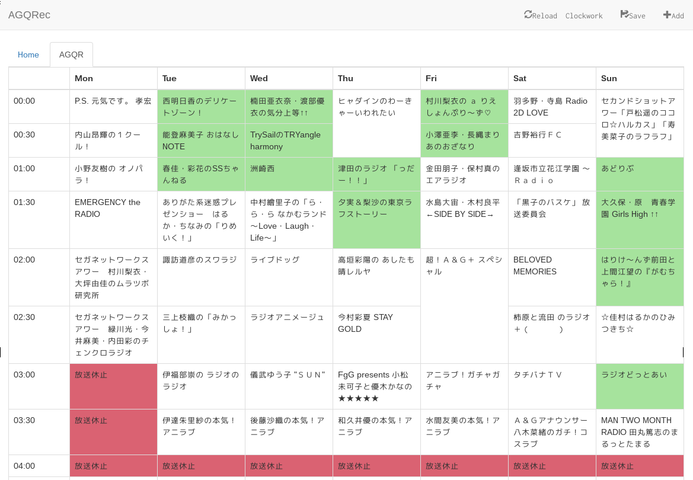

AGQRec
====

* 超！A&Gを録音するやつ, と言いながら汎用の簡易cron
* 他のところのものを録音したいときは/plugin以下に#{provider}.rbを用意して、同名のmoduleにinit, run(schedule)を定義すると呼び出されるはず
* Webインターフェース経由でジョブを追加できます
  * /api以下にいろいろ出ているのでそこも叩けます

====
## Screenshot

====

## Usage
`bundle exec rackup config.ru`

## Rerquirements
* rtmpdump
* ffmpeg

